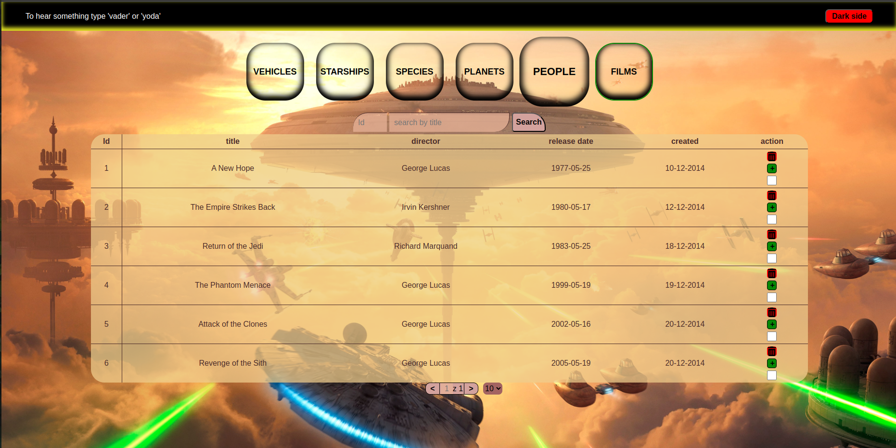
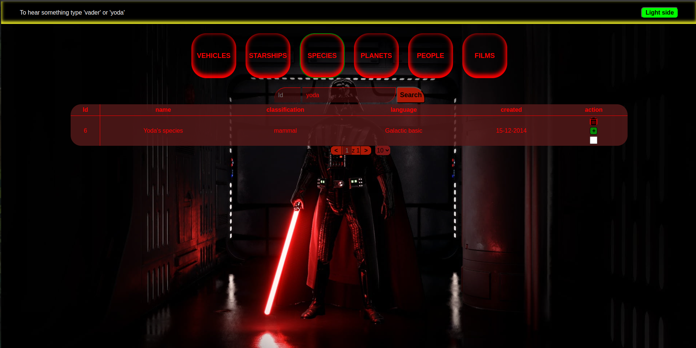
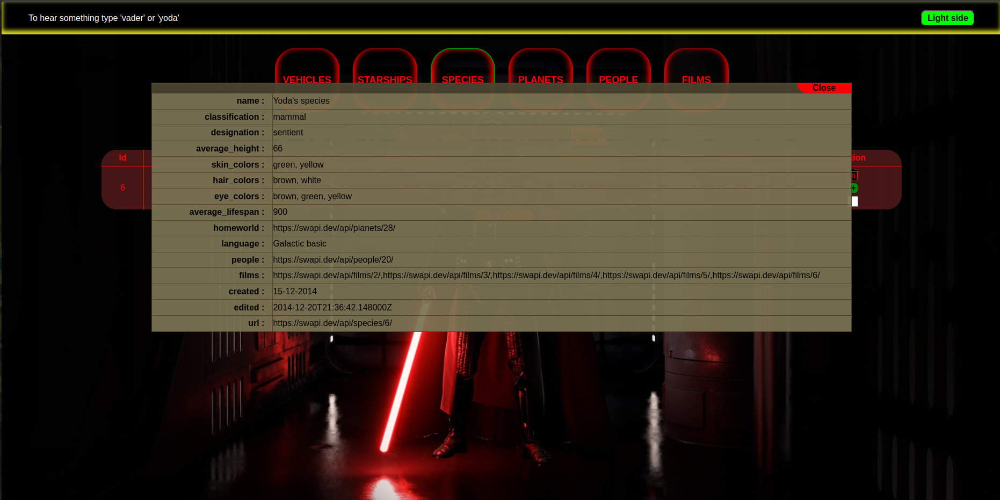

# Star Wars Data Viewer

An interactive JavaScript web app that allows users to explore various datasets from the Star Wars universe. Built entirely with vanilla JS, HTML, and CSS.

## Features

- Choose between multiple Star Wars data categories (people, films, vehicles, planets, etc.)
- Search data by name and/or ID
- Data displayed in a dynamic table with pagination
- Expand a row to view detailed information
- Delete single rows or select multiple rows to delete them all at once
- Switch between Light Side and Dark Side themes with background changes
- Type `vader` or `yoda` to play sound effects

## Tech Stack

- **HTML5** – basic structure  
- **CSS3** – custom themes and layout styling  
- **JavaScript** – app logic, dynamic DOM manipulation, event handling  

## What I learned

- DOM creation and manipulation using JavaScript  
- Managing lists of objects and filtering/searching data  
- Handling user input events (click, keyboard, input changes)  
- Applying dynamic styles and themes using CSS variables  
- Implementing audio feedback and interactive UI behavior  
- Structuring code into modular and readable functions  

## Screenshots
Light Side main view:

Light Side view with data table:

Dark Side theme:

Expanded row with details:

## How to Run

1. Clone or download the repository
2. Open `index.html` in your browser

---

This was my **first project in JavaScript**, created to learn how to work with dynamic content, styling, and user interaction. Feedback is welcome!
